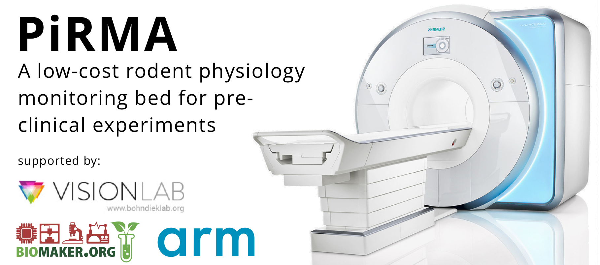

## Team Members

## Synopsis

The aim of this project is the development and implementation of a low-cost rodent physiology monitor which is suitable for a wide range of animal experiments and imaging applications. Parameters such as Heart Rate (HR), Respiratory Rate (RR), and Temperature will be presented to the user and can be fed (via an interface) into other systems. These include Magnetic Resonance Imaging (MRI) and Computed Tomography (CT) which often require gating information such as HR and RR to reduce motion artefacts. The rodents (primarily mice) will be placed in a bed which contains all the required sensors therefore removing the need for any further setup by the user. The bed will be designed to be compatible with scenarios ranging from anesthesia induction to image acquisition. Existing solutions are in the cost range of several thousand pounds and do not support the holistic workflow required in animal experiments.

## Software

The provided software reads out the data from the differential pressure sensor, the temperature sensor and the pulse oximeter. It then displays the values in the serial plotter of the Arduino software. In this implementation, the peak detection is hardcoded by a fixed threshold. A future version will include dynamic peak detection in Matlab (and Python).  

## Hardware

After connection of electronic components (as seen above or below), the differential pressure sensor can either be left open on the second vent or closed. If closed, the software has to compensate for the difference in pressure by measuring it and resetting the respiration threshold

## Installation, Maintenance and Testing Guide

A picture of a successful implementation with a readout of the pressure sensor can be seen here:

## License

This project is published under the GNU General Public License v3.0. You can find the license in the corresponding project folder.
